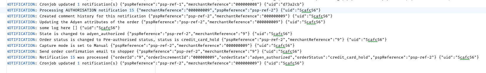
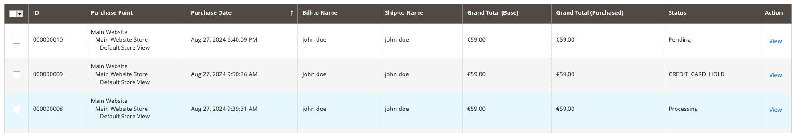

## Changes made to implement the new order flow

### Project setup:

To work comfortably I set up the project locally with docker.
The magento image used is designed to work with a reverse proxy, although In general
any php-fpm container will need a reverse proxy to pass requests to it.
I had to edit `docker-compose.yml` to add a nginx reverse proxy container.
The following is the configuration I used:

```YAML
  nginx:
    image: nginx:latest
    container_name: nginx
    ports:
      - 80:80
      - 443:443
    depends_on:
      - web
    networks:
      - backend
    volumes:
      - ./nginx/nginx.conf:/etc/nginx/nginx.conf
      - ./nginx/certs:/etc/nginx/certs
```

I also edited magento service to add a volume binding for file system accessibility from my IDE.
and removed the port binding.

```YAML
web:
  volumes:
    - ./web:/var/www/html
```

The following is the `nginx.conf` file I used to configure the request redirection with the SSL config:

```
http {
     server {
        listen 80;
        server_name localhost;
        return 301 https://$host$request_uri;
    }

    server {
        listen 443 ssl;
        server_name localhost;

        ssl_certificate /etc/nginx/certs/localhost.crt;
        ssl_certificate_key /etc/nginx/certs/localhost.key;
        ssl_protocols TLSv1.2 TLSv1.3;
        ssl_ciphers 'ECDHE-RSA-AES256-GCM-SHA384:ECDHE-RSA-AES128-GCM-SHA256:!aNULL:!MD5';
        ssl_prefer_server_ciphers on;

        location / {
            proxy_pass http://web:80;
            proxy_set_header Host $host;
            proxy_set_header X-Real-IP $remote_addr;
            proxy_set_header X-Forwarded-For $proxy_add_x_forwarded_for;
            proxy_set_header X-Forwarded-Proto $scheme;
        }

        error_log /var/log/nginx/error.log;
        access_log /var/log/nginx/access.log;
    }
}
```

I had some issues with assets not loading correctly, and payment input fields showing
an error message: Invalid Origin, using the following commands solved it for me:

```bash
docker exec -it magento2-container bin/magento setup:store-config:set --base-url="http://localhost"
docker exec -it magento2-container bin/magento setup:store-config:set --base-url-secure="https://localhost"
```

### Configuration:

In the plugin's configuration, specifically under `Stores > Configuration > Payment Methods > Adyen Payments > Order Managment`,
the status selected under `Payment authorization` is the one to be used after a successful payment authorization is confirmed by an AUTHORIZATION webhook from Adyen.


In order for the new status to show up in the drop-down it has to be assigned to Adyen's `Authorized` order state.


After these steps the configuration is complete. 

**Note:** This new status will be applied regardless of the payment method. To ensure it is only applied for specific payment methods I made code adjustments that are outlined in the next section.

### Explanation of code changes:

The goal is to locate where the status of the order is updated and to make sure that the new status is used only for credit card payments.<br>
First thing to do is identify the flow of webhook notification handling.<br>

- The plugin exposes an endpoint to Adyen in order to receive notifications. The endpoint is `BASE_URL/adyen/webhook`.<br>
- If we say endpoint we also say a controller action, the code responsible for processing incoming events is located in `Controller/Webhook/Index.php`.<br>
- The controller action will process the incoming requests data, creates a notification object and persists it in `m2_adyen_notification`.<br>
- A periodic cron job will pick up the pending notifications from the database and either publish it to a queue or process directly depending on the configuration.<br>
- The job's code is located in  `Cron/WebhookProcessor.php`. It relies on a helper class located in `Helper/Webhook.php` to process the notifications.<br>
- The helper will load a handler based on the notification's type. We are interested in `authorization` type so the handler in question is `Helper/Webhook/AuthorisationWebhookHandler.php`.<br>
- When the payment is full and successful the handler will call another Helper class: `Helper/Order.php` in order to set the order state and status. This is where our credit card check should live. Specifically in `public function setPrePaymentAuthorized(MagentoOrder $order): MagentoOrder`.<br>

**Notes:**

- I simulated the webhook by injecting a notification directly in the database and then running the cron `bin/magento cron:run`, something like:

```SQL
INSERT INTO m2_adyen_notification (pspreference, merchant_reference, event_code, success, payment_method, amount_value, amount_currency, live)
VALUES ('psp-ref-8', '000000012', 'AUTHORISATION', 'true', 'adyen_hpc', '5900', 'EUR', 'false');
```

- When testing I noticed the status is set to `processing` instead of `credit_card_hold`. I looked in the logs in `var/logs/adyen/notification.log` and I saw that the status is set correctly but immediately changed to processing, this happens after the handler generates an invoice.



- In order to make sure the status is set correctly I turned off autoCapture, this prevents the handler from creating the invoice so now we can see it in the admin.<br>



### Any considerations or limitations of the implementation

- CARD_CREDIT_HOLD is not really user-friendly as text, a more readable text should be used.
- If the payment method is not credit card the status setting is skipped, unless a default one is used, the status will remain whatever was there before, which could be semantically wrong.
- This implementation forces the use of only one status which is a limitation since it is theoretically possible to assign different statues for the same Order state.
- It is possible to set data patch to update existing orders. 

### How the new order flow works

